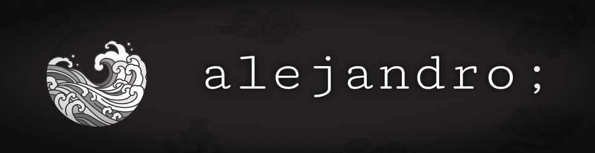

  <h1>Hi. I'm Alejandro, a developer from Venezuela 👋</h1>
  

<picture>
  <source media="(prefers-color-scheme: dark)" srcset="https://raw.githubusercontent.com/alejandrochmejia/alejandrochmejia/output/github-contribution-grid-snake-dark.svg">
  <source media="(prefers-color-scheme: light)" srcset="https://raw.githubusercontent.com/alejandrochmejia/alejandrochmejia/output/github-contribution-grid-snake.svg">
  
</picture>

  

<h2>Development Skills 💪</h2>

  

<h2>Solving problems, building innovative projects and continuously learning new technologies 🌊</h2>
<ul>
  <li>Currently studying Computer Engineering at the Universidad Jose Antonio Paez🎓</li>
  <li>An enthusiastic student and passionate developer on a mission to master Python, Java, and web development.</li>
  <li>Here on GitHub, you'll find a collection of my work, from small coding exercises to larger, more complex applications.</li>
  <li>I'm excited to collaborate with other developers and contribute to open-source projects as I grow my skills. Let's create something amazing together!</li>
</ul>
